# Getting Started

The aim of the "Getting Started" section is to convey the key WebStudio concepts and to, as far as possible, provide a more or less linear path to learning the tool. To get the best out of this guide, it is recommended that you work along and try things out for yourself. To do so, you'll need access to a running inmation instance and have login credentials to connect to the core. Also make sure you have installed the `Examples_WebStudio_Demo_Data_V<n.nn>.json` as described on the [WebStudio root](../README.md) page.

Let's quickly recap a few main points:

- The WebStudio application is used to host interactive views, called [compilations](../ReferenceDocs/README.md#compilation), made up of one or more widgets.
- The application runs in your browser of choice and is loaded using a URL that looks something this
```url
    http://<hostname_webapi>:8002/apps/webstudio/
```
- Starting from a blank canvas, you can create your own views by adding `widgets` to the compilation. 
- Widgets are able to bind to, and display dynamic data from the core inmation server and can be configured to react to user interactions. 
- Complications and the widgets contained within are defined using JSON (JavaScript Object Notation)

## Compilations basics

### Work-Space and Grid settings
To get us going, we'll create a "Hello World" compilation, consisting of a single text widget placed in the middle of the workspace. Load the application and make sure you are logged into the back end. At this point you should see the workspace with the developer toolbar icons displayed at the top. 

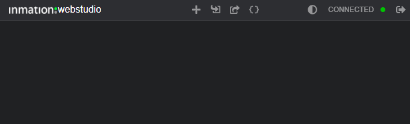

(**Note**: The application and web-studio version numbers that normally appear next to the inmation logo have been obscured in the screenshots)

The work area or canvas starts off divided into a rectangular grid of 24 columns across. When placing widgets onto the canvas they will always align to the grid and their sizes will be multiples of the grid vertical and horizontal spacing. 

As mentioned, compilations are defined using JSON text, which can seem a bit daunting at first. While the [syntax](https://www.json.org) is not too hard to follow, knowing what structure and parameter to use is not immediately obvious. Fortunately the built-in templates and editor code-completion take care of a lot of the heavy lifting for us, and if all else fails, there is always the online documentation to fall back on.

Click on the **`{}`** icon in the toolbar to show the compilation in the JSON editor. 

> **Note**: Throughout the documentation, reference is made to "Models" to refer to the set of JSON objects that define elements of the compilation or even the compilation as a whole. In the context of individual widgets, the [reference pages](../ReferenceDocs/widgets/README.md) all contain a "Model" sections describing the characteristic - minimum configurations - for the item in question. In almost all cases the actual model used will consist of the base config combined with common settings such as options and data-sources etc ... 

The initial JSON for a blank compilation looks something like this. 

```json
{
    "version": "1",
    "widgets": [],
    "options": {
        "stacking": "vertical",
        "numberOfColumns": 24
    }
}
```

The fields in the object have the following meaning:
* `version`: This is added to cater for possible future implementations where the structure of the model changes and needs to be interpreted differently. At present, the version should always be "1"
* `widgets`: Initially, while the compilation is blank, the `widgets` array is empty. It gets populated with JSON objects as widgets are added. 
* `options`: This is an important element of the model. It defines how widgets are arranged, their minimum sizes and how precisely they can be placed on the canvas. 

> **Note**: Change the number of grid columns early on in you compilation configuration cycle to provide enough resolution to place widgets where you want them. With a finer grid you can place widgets more precisely.  

The default [options](../ReferenceDocs/README.md#options) are set such that any widgets added to the compilation will be stacked vertically, starting at the top of the window. For our first example, we'd like to put the text box in the middle of the canvas, so let's change the `stacking` property. Delete the `"vertical"` setting, press **Control-Space** to bring up a list of valid stacking options, then select `"none"`. Widgets can now be place in any grid cells on the screen. 

> **Note**: It is recommended that you name your compilations as a matter of course by adding a `name` field to it and assigning a value that reflects the "purpose" of the compilation. This ensures that when the JSON is exported () to file it is easy to locate a specific one. Also remember to click the export button every now and then so you don't lose work if the browser page is re-loaded for some reason. 

```json
{
    "version": "1",
    "name": "HelloWorldCompilation",
    "widgets": [],
    "options": {
        "stacking": "none",
        "numberOfColumns": 24
    }
}
```

In general the **Control-Space** keyboard shortcut can be used to show the properties (and possible values in some cases) that are applicable within the various sections of the model. To see this in action, place the edit cursor at the end of the line ```"stacking":"none",``` and press **Control-Space** again to be prompted with the available, as yet un-used, options. 

> **Note:** Entering a **space** when the cursor is placed in a position where new properties can be added, will also show the code-completion pop-ups. The difference between this and hitting **Control-Space** is that the latter also works while you are editing object properties and values (inside string double quotes).  

We'll return to the compilation in a bit. For now, close the editor and click on the **`+`** icon at the top of the browser window to bring up the widget editor. It presents a palette of pre-configured templates on the left. 

Expand the "Text" tree node and select "Simple Text", to insert the boilerplate JSON. From here we can start customizing the widget's appearance and behavior. Let's change the value of the `text` property to "Hello World". 

Next we'll adjust the text widget to be two grid cells high and six wide. Move your edit cursor to the end of the line that now reads: 
```json 
"text": "Hello World", 
``` 
and press the space bar. From the available options, select `layout`, which inserts a JSON fragment.

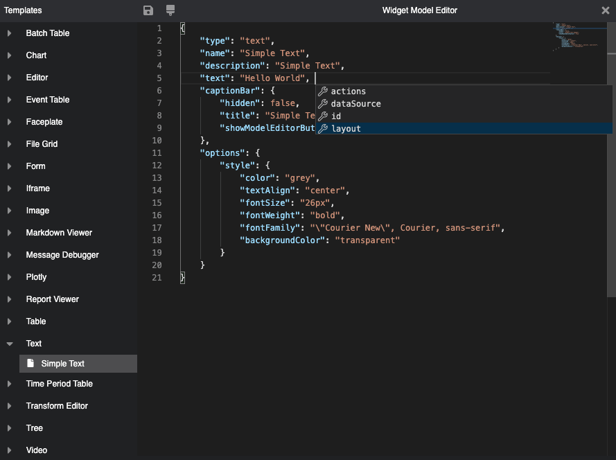

Press the space bar again to see the available `layout` fields and set `"h"=2,` and `"w"=6`. At this point the JSON formatting is out of kilter, which we can fix by clicking the format  icon at the top of the window. As a last refinement before adding the widget, let's change the text `color`. Place the cursor inside the current value (`"grey"`) of the `options.style.color` field and press **control-space** to pick a color.   

> **Note**: Dot-notation is used as a shorthand to refer to nested properties in the JSON models as shown above. The notation is fairly self-explanatory. One special case worth mentioning more explicitly is when referring to objects in arrays. Consider the arbitrary JSON below:
>```json
>{
>    "data": [
>        {
>            "x": 0,
>            "y": 1.2
>        },
>        {
>            "x": 1,
>            "y": 3.8
>        }
>    ]
>}
>```
>
>To refer to the y-value of the second data point, the notation used is `data.1.y`


Apply the selection, by clicking on the save icon then drag the widget to the center of the canvas. 

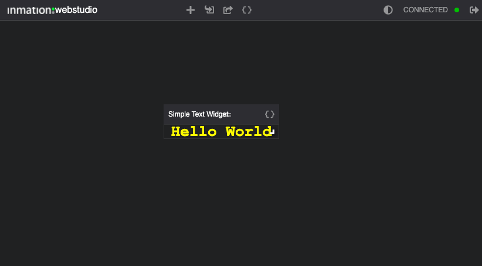

### Widget title-bar and resize handles

To finish things off, let's remove the title-bar and resize drag handle, in the bottom right corner, from the widget. Click the `{}` in the widget title-bar and set the `captionBar.hidden` field to `true`, then apply the change to see what it looks like... 

So far so good, except... with the title-bar now hidden, how do we get back to the Widget's JSON to make further changes? The answer is to use the compilation editor. Click the `{}` at the top of the work area and locate the text widget in the compilation's `widgets` array. 

In this case, it is easy to do since there is only one widget in the compilation, but in general finding your widget in the array will be more cumbersome. There are two strategies that may help to mitigate the problem: 

- Use the editor's "Find" function (**Control-F** or **⌘-F** on Mac) to search for a string you know to be part of the widget you are looking for. 
- Use the editor's code-folding arrow buttons in the left sidebar of the editor to collapse sections of the JSON you want to ignore. 

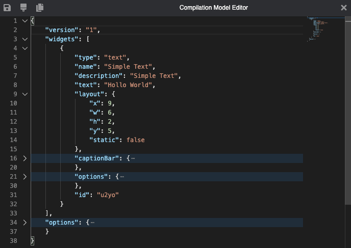

With the compilation JSON loaded in the editor, change the `widgets.0.layout.static` property to `true` and apply the changes to remove the re-size drag handle, which leaves us with the final result:

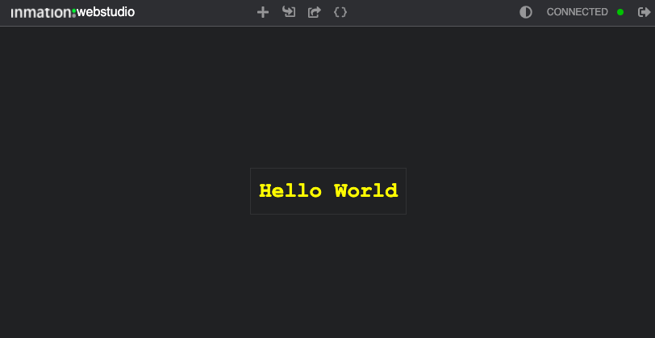

... OK, that was somewhat underwhelming, so we'll pick up the pace a bit. 

Before moving to the next section here are a few things you can try on your own:
> **Things to try**:
> - Add one instance of each of the templated widgets to your compilation,  to get an impression of what they look like. 
>
>> **Note** Most of the template widgets are pre-configured to bind to the example demo data mentioned above so they can show actual values. If your inmation system was installed to use the host machine name as the name of the "Core" node in the IO-Model, you will need to update the bindings in the widgets config. (We'll return to the topic of [data-binding](#data-binding) in a bit more detail below)
>
> For example: If you add the `Faceplate` templates for tag `FC4711`, its default model JSON looks like this:
>```json
>{
>    "type": "faceplate",
>    "name": "FC4711",
>    "description": "Process Data FC4711",
>    "path": "/System/Core/Examples/Demo Data/Process Data/FC4711",
>    "captionBar": true,
>    "layout": {
>        "h": 4
>    }
>}
>```
>On the DataStudio side you might find that the actual path to the referenced tag is something like "/System/*INMATION-HOST-01*/Examples/Demo Data/Process Data/FC4711". To make the binding work in WebStudio all path values then need to be  updated by replacing occurrences of /core/ with the name used (such as *INMATION-HOST-01* in the example). 
>
>In the editor press **^-F** (**⌘-F** on Mac) to show the **Find** option and enter the string to find.
>
>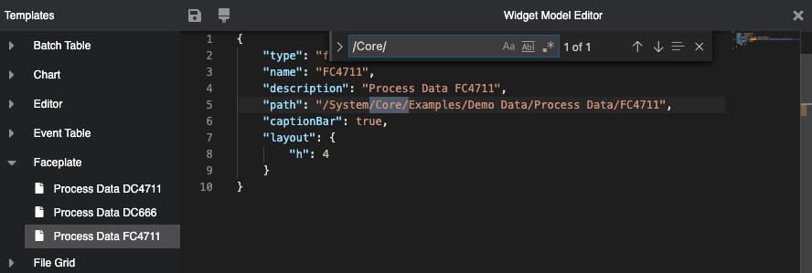
>
>Press the **>** arrow in front of the find input box to show the **Replace** input box, enter the name of your Core node and click the "Replace All" button (the icon to the far right of the replace field).
>
>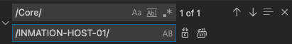 
>
>If all went according to plan, the Faceplate should show up with live data:
>
>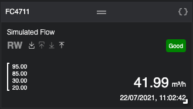
>
> - Experiment with the code-completion options to see which config options are
> available in addition to the 'out-of-the-box' templates settings. 

## Displaying inmation data
The reason for creating compilations in most cases is to display core data to platform users. In some situations modifications may need to be made by editing, adding or deleting information. For now, the focus is on how to retrieve and display information. 

### Path based bindings
The `path` of objects, typically in the IO and KPI models, is how they are uniquely identified in the system and is therefore used to configure direct data bindings in WebStudio. **Note**: Model in this context refers to how things are configured on the server side rather than in the compilation!

Where in the compilation model the `path` is specified is somewhat Widget dependent. Consider the following examples:

- `Faceplate`: Here the path is a base property of the widget
    ```json
        {
            "type": "faceplate",
            "name": "DC4711",
            "description": "Process Data DC4711",
            "path": "/System/Core/Examples/Demo Data/Process Data/DC4711",
            "captionBar": true,
            "layout": {
                "h": 4
            }
        }
        ```
- `Chart`: The chart is quite a complex widget and is able to retrieve core data in a number of ways, the most direct of which is to define one or more pens and to set their path properties. 
    ```json
    {
        "type": "chart",
        "chart": {
            "pens": [
                {
                    "path": "/System/Core/Examples/Demo Data/Process Data/DC4711",
                    "aggregate": "AGG_TYPE_INTERPOLATIVE", ...
                }
            ],
            "x_axis": [...],
            "y_axis": [...],
        },
        "name": "Webchart with pen",
        "description": "Webchart with pen",
        "layout": {...}
    }

    ```

### Data Source
Most widgets that display data can be configured to do so by specifying the appropriate [dataSource](../ReferenceDocs/widgets/README.md#datasource) settings. The `dataSource` property supports a number of options which determine the binding behavior. Let's have a look at some of these applied to a `Text` widget:

> **Note**: The `Text` widget is used here to illustrate the concepts due to its simplicity rather than its inherit suitability for that purpose.

#### Read
When the `dataSource` type is set to `"read"` the value of the item pointed to by the `path` is read whenever the widget is refreshed, rather than when the underlying value changes. Any subsequent updates to the tag value will not show up automatically in the UI
```json
{
    "type": "text",
    "text": "",
    "dataSource": {
        "type": "read",
        "path": "/System/Core/Examples/Demo Data/Process Data/DC4711"
    },
    "layout": {
        "w": 6,
        "h": 2
    },
    "id": "demoTxt"
}
```

> **NOTE** If you use this JSON, the tag value is shown with many decimals. This can be changed as is sown in this [example](./compilations/text/text-subscribe-01.json). 

The `"read"` dataSource type is therefore more often used for properties, such as the number of decimals on the tag or the engineering units, that tend to be static. (The engineering units can be read by appending the property name to the path as show)

```json
    {
        "type": "read",
        "path": "/System/Core/Examples/Demo Data/Process Data/DC4711.OpcEngUnit"
    },
```

#### Subscribe
In the example above, we could have "worked around" the fact that the data source is only read when the widget is refreshed by specifying a `refreshInterval` in the model, like so:

```json
{
    "type": "text",
    "text": "",
    "options": {
        "refreshInterval": 10
    },
    "dataSource": {
        "type": "read",
        "path": "/System/Core/Examples/Demo Data/Process Data/DC4711"
    },
    "layout": {
        "w": 6,
        "h": 2
    },
    "id": "demoTxt"
}
```

Now the source value will be polled once every ten second. While this works, it is not ideal since there is no guarantee that the underlying value changes at the same rate as the refresh interval.

A better approach is to change the dataSource type to `"subscribe"`. WebStudio will now be notified whenever the tag value we subscribed to changes. 

#### Function
A third option is to use a `function` type `dataSource` to call an [advanced endpoint](https://inmation.com/docs/api/latest/webapi/advancedendpoints.html) which in turn executes Lua script in the back end. The ability to call custom code in the core provides a great deal of flexibility, opening the door to manipulating or even generating data as required. 

To see this in action, add a table widget to your compilation and select the "Data source function" template in the `Table` section. The JSON in the editor should looks something like this:

```json
{
    "type": "table",
    "description": "Data Source function",
    "name": "Demo Process Data",
    "dataSource": {
        "type": "function",
        "lib": "webstudio-demo",
        "func": "demoProcessDataTableData",
        "ctx": "/System/Core/Examples/WebStudio"
    },
    "schema": [ ... ],
    "captionBar": true,
    "options": { ... },
    "layout": { ... }
}
```

> **Things to try:**
> - Pick one of the widgets and experiment with the various data source types discussed. Try setting up our own core objects and show their state in WebStudio
> - Look at all the templates to see where they get their data from. (You will need the demo dataset to see them in action)

While there is quite a lot more that can be said about dataSources, there are some other important topics to get to...

## Hooks, Actions, Messages and Pipelines.
As we've seen so far, WebStudio takes JSON models and uses these to work out what to draw on the screen. In doing so, it goes through a set of phases during which the model is processed, data is retrieved, the UI is updated and so on. 

### Life cycle hooks
Webstudio provides life cycle hook to allow us to react to the start and end of each of the phases (don't worry if that statement doesn't make 100% sense yet, things should become clearer in a bit). 

Most of the [life cycle hooks](../referencedocs/widgets/readme.md#life-cycle-hooks) come in pairs which are triggered once before the relevant processing happens and after it has completed. The didLoad hook is the exception. 

These are the available lifecycle hooks:
- `didLoad` : A compilation was loaded. This happens when the compilation is loaded from disk or the backend using a URL, but also when edited. 
- `willUpdate` / `didUpdate` : The UI will be/has been updated. Typically due to something needing to be redrawn after a model property change.
- `willFetch` / `didFetch` : Indicates that values for data bindings of type "read" will be retrieved from the backend. These hooks are triggered inside the will/did refresh. 
- `willRefresh` / `didRefresh` : The refresh life cycle is triggered when data from the backend needs to be fetched and the UI updated. It brackets the fetch and update phases. In other words, the refresh life cycle looks like this: `willRefresh`, `willFetch`, `didFetch`, `willUpdate`, `didUpdate`,`didRefresh`

> **Something to try:** Take a peek at the sample compilation which demonstrates the sequencing of the [lifecycle hooks](./compilations/gettingstarted/lifecycle-hook-demo.json). It relies on some WebStudio features we are yet to cover, so the explanation of how it works may still be a bit opaque at this stage... We'll return to that a little later.      

### Action Hooks
Depending on the widget, there are also action-hooks that are triggered when a user interacts with the widget in some way, such as clicking on it for examples or submitting a form. 

To define what happens in response to any of the triggers firing, all widget can have an `actions` property configured. Let's look at an example...

Starting from a blank compilation, click the `+` toolbar options and paste in the JSON config for a `Text` widget.

```json
{
    "type": "text",
    "name": "Simple Text",
    "text": "Click Me",
    "actions": {
        "onClick": {
            "type": "notify"
        }
    },
    "captionBar": true,
    "layout": {
        "w": 8,
        "h": 2
    }
}
```

From the JSON we see the `actions` property, contains `onClick` which is the name of the trigger we want to respond to. `onClick` in turn contains an action object of type `notify`. The effect of all this is that when you click on the text, a "notification" is pop up in the top right corner of the workspace, displaying the widget's name: "Simple Text".

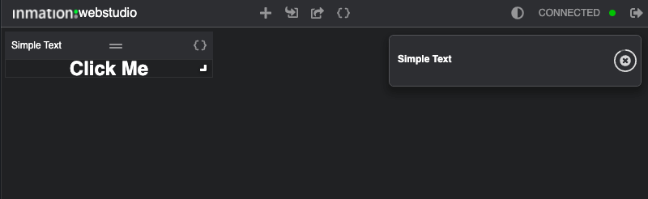

In this example, none of the settings available to customize the `notify` action have been used. Refer to the [Actions](../ReferenceDocs/actions/README.md#notify) help pages for a full list of all the available options. 

### Messages
One very important aspect of the way actions work is that they all receive a `Message` object as input, which in turn will always have at least one property called `payload`. The content of the payload field is populated by the widget which triggered the action. It initializes the payload with values from its current state. We'll come back to this in more detail, but let's first see the `Message` in action.

Consider the compilation shown below. It has two "buttons" (text widgets with `onClick` actions) on the left. These set the background color of the "Status" text widget to red or green when clicked. 

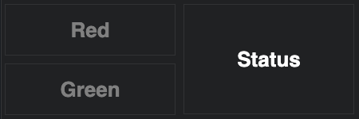

After clicking on "Green" for example, the view changes to:

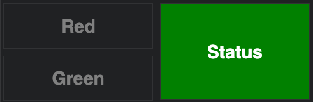

The configuration of the "Red button" is shown below (The compilation JSON is linked: [redgreen_v1.json](./compilations/gettingstarted/redgreen_v1.json) )

```json
{
    "type": "text",
    "text": "Red",
    "captionBar": false,
    "actions": {
        "onClick": {
            "type": "modify",
            "id": "indicator",
            "debug" : true,
            "set": [
                {
                    "name": "model.options.style.backgroundColor",
                    "value": "$payload"
                }
            ]
        }
    },
    ...
}
```

The action triggered by the `onClick` hook is of type [modify](../ReferenceDocs/actions/README.md#modify) which, as the name suggests, is used to make changes to widgets in the compilations. The `id` field identifies the target widget to be modified. 

In the modify action, multiple properties of the target widget can be changed at once. The `set` property, for example, is an array of { `name`, `value` } pairs indicating the fields to change and the values to set them to. 

Notice that there is also a `debug` property (set to `true`). It causes the `message` object to be written to the browser's console from where we can inspect the content. 

> To bring up the browser console, **right-click** anywhere on a blank area of the workspace and select "inspect" from the popup menu. Choose the  console tab on the inspect panel if it is not already shown. For most browsers the console is a "developer mode" feature which may need to be enabled before it is available. A quick bit of "googling" for the term "show browser console" should take you to the detailed instructions to get at the console for your browser type.

The `message` printed to the console, by the modify action above, looks like this:

```json
{
    "model": {
        "captionBar": false,
        "description": "Simple Text",
        "id": "indicator",
        "name": "Simple Text",
        "options": {
            "style": {
                "color": "White",
                "textAlign": "center",
                "fontSize": "26px",
                "backgroundColor": "transparent"
            },
            "text": "Status",
            "type": "text"
        },
        "layout": { "x": 3,  "w": 3,  "h": 2,  "y": 0, "static": true }
    },
    "payload": "Red"
}
```
Notice that in addition to a `payload` property we also have a `model` property which is the model JSON of the target widget. 

> **Note**: Modify is the only action which includes a model field in the message. The field is added internally by the  action, based on the widget to be modified and only exists in the context of the action.  

Knowing the structure of the message, the earlier `set` statement hopefully starts making sense. In short, it states that the background color of the widget called "indicator" should be set to the text value of the clicked widget. 

- `"name"`: "model.options.style.backgroundColor" refers to the name of the property, in the target widget, that will be modified by the action in dot-notation. In this case we are setting the widget background color.
- `"value"`: "$payload" assigns the value of the message `payload` to the background property. The `$` in front of the field indicates that we need to resolve the value of the field as opposed to assigning the string "payload".   

### Named actions 
As things stand, the `actions` configuration for both the red and green buttons are identical. If we decide, for example, that the `onClick` behavior should also set the text of the indicator in some way, the change would need to be applied in both places. As a general principle this is something we'd like to avoid. It would be better if the click behavior could be defined somewhere centrally from where either of the widgets could invoke it when clicked. 

We can do just that, by creating a ["named"](../ReferenceDocs/actions/README.md#action) action at the compilation level and have the red and green widgets use it instead of their current local settings. Here is how this works.

- Start by copying the actions section of either the "red" or "green" Text widgets into the compilation model as shown. Notice that the name of the trigger was changed from `onClick` to `myClickAction`. By doing this, we are not creating a new trigger, but defining a named action sequence that can be invoked as an atomic action. (You can chose any name as long it differs from the pre-defined hooks)

```json
{
    "version": "1",
    "actions": {
        "myClickAction": {
            "type": "modify",
            "id": "indicator",
            "debug": true,
            "set": [
                {
                    "name": "model.options.style.backgroundColor",
                    "value": "$payload"
                }
            ]
        }
    },
    ...
}
```
- Next modify the `onClick` behavior of each of the red and green text widgets to invoke our newly created named action sequence. 
```json
{
    "type": "text",
    "text": "Red",
    "actions": {
        "onClick": {
            "type": "action",
            "name": "myClickAction"
        }
    },
    ...
}
```
The reason this works is because when the `onClick` hook triggers, it passes a message to the local `action` containing the payload of the source widget (the text in this case). It in turn hands the message down to `myClickAction`, from where the same modifications as before are applied.

> **Note**: Named action are scoped to the widget that declared them or, as in this case, to the compilation as a whole.  In the latter case all the widgets in that compilation have access to the named action.

### Pipelines
The next key concept to introduce is that of the action **pipeline**. When a specific hook, such as `onClick`, triggers a sequence of actions can be called one after another to perform complex tasks. This is referred to as a pipeline due to they way in which messages are taken in by each action in the sequence and passed down to the next one along. 

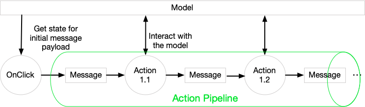

The content of the outbound message depends on what the action does to it. Many actions can enrich the incoming message with extra fields to be used by those further down the chain. 

To see how this works, we'll modify the earlier example to display the time when the button was pressed in the status Text widget.

To do so, modify `"myClickAction"`, by changing its value to an array of actions (using square brackets instead of curly ones)  and adding a new action as shown. You can also just replace the compilation (v2) from the source provided in the [link](./compilations/gettingstarted/redgreen_v2.json)

```json
"myClickAction": [
    {
        "type": "gettime",
        "set": [
            {
                "name": "time",
                "value": "*"
            }
        ]
    },
    {
        "type": "modify",
        "id": "indicator",
        "debug": true,
        "set": [
            {
                "name": "model.options.style.backgroundColor",
                "value": "$payload"
            },
            {
                "name": "model.text",
                "value": "$payload.time"
            }
        ]
    }
]
```

We now have an action pipeline, where the first [gettime](../ReferenceDocs/actions/README.md#gettime) action receives a message from the Text widget in response to the `onClick`. The `gettime` action adds the current time to a field called `time` in the payload, and passes the enriched message to the `modify` action, where we finally update the status Text widget.

The output from clicking on either the "red" or "green" widgets looks like this:

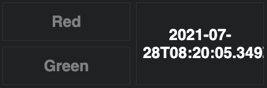

Hmm... The change sort of worked in that the time-stamp is being displayed, but the status background is not being set to red or green any more. To make sense of this, let's modify the action pipeline to output the content of the message at various steps. 

The `MessageDebugger` widget is very useful in this regard. By adding some extra actions in the flow to sent the message to a debugger, we should be able to work out what is going on. 

Start by adding a `MessageDebugger` widget to your [compilation (v3)](./compilations/gettingstarted/redgreen_v3.json). Then update the action pipeline by inserting a `send` action to the top of the pipeline allowing us to see what we start off with.

```json
"myClickAction": [
    {
        "type": "send",
        "to": "debugger"
    },
    {
        "type": "gettime",
        "set": [
            {
                "name": "time",
                "value": "*"
            }
        ]
    },
    {
        "type": "modify",
        ...
    }
]
```

Clicking on either of the red or green widgets will first update the debugger output to show the content of the message at the start of the pipeline before getting the time and modifying the status text. 

After clicking on "Red" the debugger window shows that the message is set to:

```json
{
    "payload": "Red"
}
```

This is more or less what we expected. So, let's move the debugger output step to after the `getttime` action to see what we get. 

```json
"myClickAction": [
    {
        "type": "gettime",
        "set": [
            {
                "name": "time",
                "value": "*"
            }
        ]
    },
    {
        "type": "send",
        "to": "debugger"
    },
    {
        "type": "modify",
        ...
    }
]
```

After clicking, the message now looks something like this:

```json
{
    "payload": {
        "time": "2021-07-28T08:53:42.270Z"
    }
}
```

The `time` field in the payload is correct, but we somehow lost the text from the source widget. Examining the two messages a bit more closely, the problem becomes clear. 

From the Text widget the payload is set to a single string, "Red" or "Green", but when we get the time the payload is replaced with a new object containing a field called `time`. The reason this happens is because with a starting payload value of type "string" there is nowhere to append extra fields, so the payload is replaced with an object to which things can be added.

{"payload" : "Red"} -->  {"payload" : { "time" : "2021-07-28T08:53:42.270Z"}}

To fix this, we need to transform the message payload received from the text widget such that the string value is converted to an object containing the widget text. In other words, we want do something like this: 

{"payload" : "Red"} --> {"payload" : {  "color" : "Red" }}

`color` is the name chosen for the text property, but any name will do.

To affect the change, we use a `transform` action. [transform](../ReferenceDocs/actions/README.md#transform) actions are a whole topic of their own, so we won't go into much detail here. What you need to know to follow the further discussion is this:

- A `transform` action use [MongoDB aggregation pipeline](https://docs.mongodb.com/manual/meta/aggregation-quick-reference/) syntax to specify how the input message should be modified and returned as an output message to the next WebStudio action. 
- Within the `transform` action the `aggregateOne` field contains an array of MongoDB pipeline stages that are daisy chained to achieve the desired output, in the same way the WebStudio action pipeline do. 
- For the purpose of this example, the ["$project"](https://docs.mongodb.com/manual/reference/operator/aggregation/project/#mongodb-pipeline-pipe.-project) stage is used. As the name suggests, it "projects" or maps fields from the input message to chosen fields in the output.
- The output of the `transform` actions is applied to the payload field of the message.

Change the action definition in the compilation as shown:

```json
"myClickAction": [
    {
        "type": "transform",
        "aggregateOne": [
            {
                "$project": {
                    "color": "$payload"
                }
            }
        ]
    },
    {
        "type": "send",
        "to": "debugger"
    },
    {
        "type": "gettime",
        "set": [
            {
                "name": "time",
                "value": "*"
            }
        ]
    },
    {
        "type": "modify",
        ...
    }
]
```

Notice that we moved the debugger "send" action to be immediately after the transform actions, so we can inspect what the change looks like, which is: 

```json
{
    "payload": {
        "color": "Red"
    }
}
```

While this output is exactly what we want, it is actually somewhat surprising that the new field is placed inside a "payload" object as opposed to being at the message level as shown below. There is afterall no mention of a `payload` field in the "project" statement!? 

```json
{
    "color": "Red"
}
```

The reason for this is that WebStudio intervenes, as mentioned in the last bullet-point above, and places the output of the transform action into the message payload... **unless** the output from the action is already contained in a field called "payload". 

This behavior can be quite confusing at times, so for case sake of clarity, the transformation is changed as shown below. Here, the payload field is explicitly added to the `$project` statement. The output this produces is exactly the same as we had before but at least it is now clear why this is the case... 


```json
"myClickAction": [
    {
        "type": "transform",
        "aggregateOne": [
            {
                "$project": {
                    "payload": {
                        "color": "$payload"
                    }
                }
            }
        ]
    },
    ...
]
```

Moving the debugger `send` action to be after the `gettime` action, the output now looks a lot better. 

The JSON below confirms that the `$project` stage of the `transform` action has placed the color text, read from "$payload", into a new `color` field, and `getttime` has added the ISO time string next to it.
 

```json
{
    "payload": {
        "color": "Red",
        "time": "2021-07-28T10:05:07.174Z"
    }
}
```


OK, but our target status background is still not updated. All that remains is to fix up the `modify` action to retrieve the color setting from the correct location in the message payload. Update the action pipeline in your [compilation (v4)](redgreen_v4.json) as shown:

```json
{
    "type": "modify",
    "id": "indicator",
    "debug": true,
    "set": [
        {
            "name": "model.options.style.backgroundColor",
            "value": "$payload.color"
        },
        {
            "name": "model.text",
            "value": "$payload.time"
        }
    ]
}
```

Clicking on the "Green" text results in:

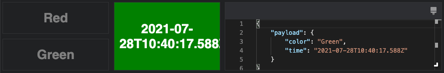

As a final flourish, before moving on, let's fix up the formatting of the time-stamp in the status widget to be something like this:

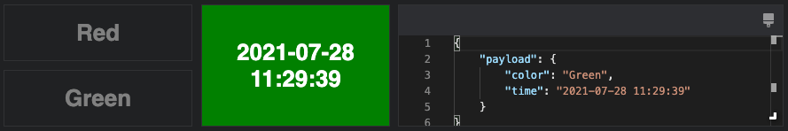
For this, the transform action is once again the tool to use. 

Add this additional `transform` action to the pipeline just after the `gettime` action as shown:

```json
{
    "type": "transform",
    "completeMsgObject": true,
    "aggregateOne": [
        {
            "$addFields": {
                "date": {
                    "$dateFromString": {
                        "timezone": "+01",
                        "dateString": {
                            "$substr": [
                                "$payload.time",
                                0,
                                {
                                    "$add": [
                                        {
                                            "$strLenCP": "$payload.time"
                                        },
                                        -1
                                    ]
                                }
                            ]
                        }
                    }
                }
            }
        },
        {
            "$project": {
                "color": "$payload.color",
                "time": {
                    "$concat": [
                        {
                            "$dateToString": {
                                "format": "%Y-%m-%d",
                                "date": "$date"
                            }
                        },
                        " ",
                        {
                            "$dateToString": {
                                "format": "%H:%M:%S",
                                "date": "$date"
                            }
                        }
                    ]
                }
            }
        }
    ]
},
```

I know... this is a lot af transformation to convert from "2021-07-28T12:29:39.100Z" to "2021-07-28 13:29:39", and to be honest, it's not really that important to understand it all right now. If you are curious though, here is a quick rundown of what is going on in the `aggregateOne` section of this transformation:

* We start by taking the ISO Date string received as input and convert it to a new field of type *Date*, adding it to the message in a field called `date`. 
    * The `$dateFromString` function is used to parse the incoming string. It takes a `dateString` input parameter and an optional `timezone` (set to +1hr in this case). 
        * The input date string ends with a Z to indicate the time is expressed in UTC. The `$dateFromString` function however does not understand this format, so we need to remove the trailing character by using the `$substr` function to trim off the last character. 
        * To calculate the number of characters to return from the start of the string, one is subtracted from the length of the input string, which we get using `$strLenCP` 
* With the input time string now conveniently converted to a *Date* object, we can project the required fields to the output message.
    * The `color` field is retained by retrieving it from "$payload.color"
    * A new `time` value is constructed by concatenating date and time strings together with a space between them using the `$concat` function.
        * The Date and Time strings are generated using the `$dateToString` function which formats the *Date* object according to the options supplied.

## Initial-model vs. Work-model
We've covers quite a lot of ground so far and are almost there as far the WebStudio fundamentals go. The last topic we want to cover here is that of the "Work-Model"

When the concept of messages with payload was introduced the statement was made that: *"The content of the payload field is populated by the widget which triggered the action. It initializes the payload with values from its current state"*

This suggests that widgets in the model have some initial state, that the state can be changed and that widgets somehow keep track of the changes. The way this is done is through the **Work-Model**.

When a compilation is created in WebStudio, it maintains this configuration in memory as the **Initial-Model**. Immediately after applying any such config, WebStudio becomes active, reading data from the backend and allowing user interaction with the UI. In so doing, it is possible to substantially modify the appearance and structure of the compilation and by extension the underlying model. 

In order to ensure that none of these dynamics changes overwrite the compilation under construction, WebStudio makes a copy of the initial-model, into the work-model, when the compilation loads. All runtime changes are applied to the work-model. 

The work-model can be inspected using the compilation and widgets editors. To see this in action, go back to the "red-green" sample from before and click on one of the buttons which will apply a change to the work-model. Now load compilation in the editor (click `{}`) and select 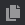 on the editor toolbar

The editor now shows the difference between the initial-model (on the left) and the work-model. The marks in the right margin highlight where the two models differ. This view is really useful while creating compilation. It allows us to verify that actions work as expected and shows exactly what data is loaded from the core. 

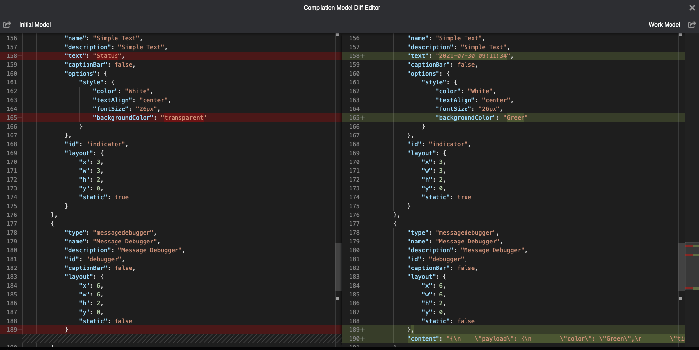

The initial and work-models can be exported by clicking on the respected icons in the toolbar at the top of the frame.

## What next?
Many of the topics discussed so far will likely only really start miking sense once you've tried to build some compilations of your own. 
As with any new tool, it takes a bit of time to become acquainted with it, and WebStudio is no exception. 

A set of [examples compilations](./compilations/README.md) is provided to help things along and hopefully answer some of the questions you might have while creating your own views.


<!-- TODO : Complete -->