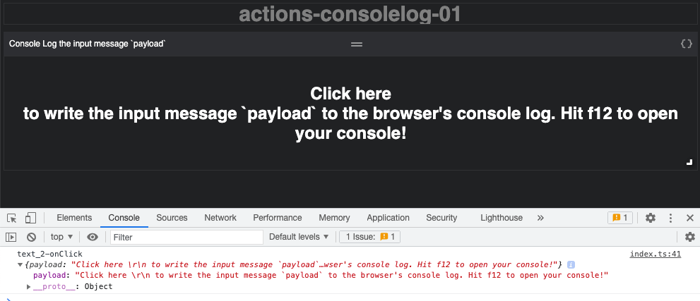
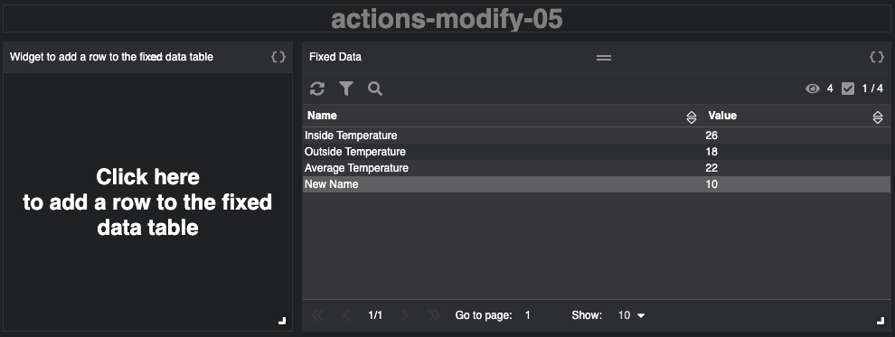

# Action Compilation

In this section you can find compilation examples of actions. Examples are showing how and to use specific actions.

| Examples | Description | Screenshot |
| --- | --- | --- |
| [cellClick-01](./cellClick-01.json)| Click on a cell in a table to executes a named action. ||
| [collect-selected-rows-01](./collect-selected-rows-01.json) | Click a Text widget to executes a collect action on selected table rows.||
| [collect-table-data-01](./collect-table-data-01.json) | Click a Text widget to collect the entire table dataset and combine this with the initial message payload.||
| [consolelog-01](./consolelog-01.json) | Click to executes a `consoleLog` action. The Text widget payload is logged to the console.||
| [consolelog-02](./consolelog-02.json) | Click to executes a `consoleLog` action. The Text widget payload is logged to the console with a tag.||
| [consolelog-03](./consolelog-03.json) | Click to executes a `consoleLog` action. Custom payload is logged in the console with a tag.||
| [consolelog-04](./consolelog-04.json) | Click on a cell executes a `consoleLog` action. Message payload is merged with key-value data and logged in the console with a tag.||
| [copy-01](./copy-01.json) | Click on a cell copies text.||
| [copy-02](./copy-02.json) | Click on a cell copies text and notifies.||
| [function-01](./function-01.json) | Click on a cell invokes advanced endpoint.||
| [invoke-action-by-name-01](./invoke-action-by-name-01.json) | Click invokes named actions. The first is defined on the Text widgets. This named action invokes a second defined at the compilation level.||
| [modify-01](./modify-01.json) | Click to modifies text size and color.||
| [modify-02](./modify-02.json) | Click to modifies text size.||
| [modify-03](./modify-03.json) | Click to sets the text style to default.||
| [modify-04](./modify-04.json) | Click to changes the aggregation of the pen in the chart.||
| [modify-05](./modify-05.json) | Click to adds a new row to the table.||
| [modify-06](./modify-06.json) | Click to remove a row from the table.||
| [modify-07](./modify-07.json) | Click to remove a table row where the match condition is stated as "<column-name>" : "<cell-value>" .||
| [modify-08](./modify-08.json) | Click to remove a table row where the match condition is expressed as an array of { "name" : "<column-name>", "value" : "<cell-value>" } objects.||
| [modify-09](./modify-09.json) | Click to filters out table rows based on a greater then or equal to criteria.||
| [notify-01](./notify-01.json) | Click to invoke a notification action.||
| [openlink-01](./openlink-01.json) | Click to open a hypermedia link.||
| [passthrough-01](./passthrough-01.json) | Click to passes input message payload to the next action in the pipeline, which in this case is the browser consoles.||
| [prompt-01](./prompt-01.json) | Click to show a prompt dialog containing a text widget.||
| [read-lua-kpi-table-01](./read-lua-kpi-table-01.json) | Click to retrieves a KPI table.||
| [read-object-value-01](./read-object-value-01.json) | Click to retrieve data from the read endpoint.||
| [read-write-01](./read-write-01.json) | Table data is retrieved using read endpoint, click on save button to write data to the endpoint||
| [send-01](./send-01.json) | Click to send data to editor widget.||
| [send-selectRows-01](./send-selectRows-01.json) | Click to select table rows using a send action.||
| [switch-01](./switch-01.json) | Click on a table cell in a specific column to execute an action based on a matching case condition. Also illustrates the use of multiple pipelines.||
| [transform-example-01](./transform-example-01.json) | Transform input using MongoDB's Aggregation Pipeline's $project logic. Illustrates the use of the Transform Editor||
| [transform-example-02](./transform-example-02.json) | Transform input using MongoDB's Aggregation Pipeline's $match logic.||
| [transform-example-03](./transform-example-03.json) | Filter input based on key value.||
| [transform-example-04](./transform-example-04.json) | Filter input based on key value and return first matching result.||
| [transform-example-05](./transform-example-05.json) | Transform entire input using MongoDB's Aggregation Pipeline logic.||
| [wait-example-01](./wait-example-01.json) | Click on a cell prompts notification with one second delay.||
| [write-example-01](./write-example-01.json) | Click on a cell increases or decreases value of inmation object.||
