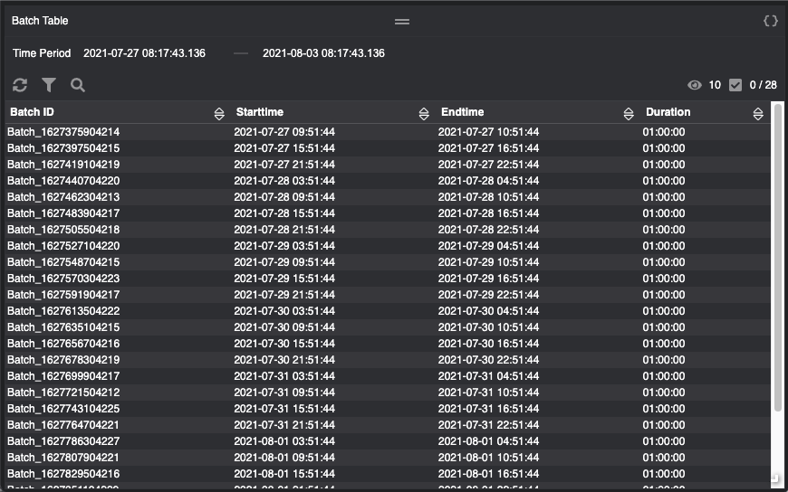

# Batch Table

| Examples | Description |Screenshot |
| --- | --- | --- |
| [batchtable](./batchtable.json)| Fetch batch table. Initialize the start and end times for the batch data in the `didLoad` handler||
