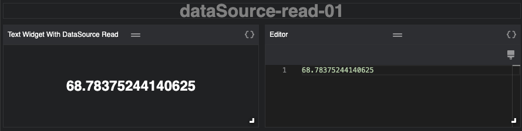
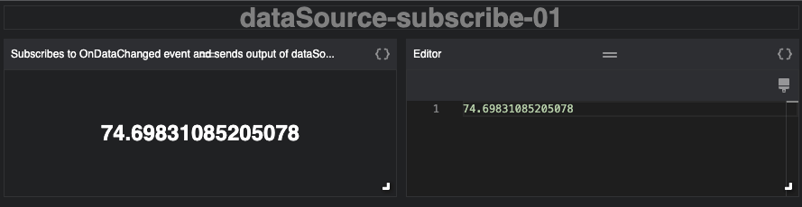
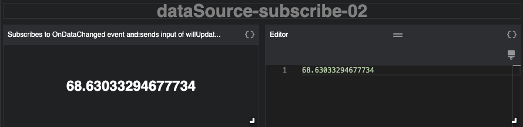
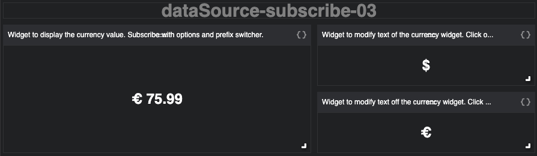

# Data Source Compilations

| Examples | Description | Screenshot |
| --- | --- | --- |
|[datasource-read-01](./datasource-read-01.json)| Read object value. Demonstrates how to use the `dataSource` as an action pipeline||
|[datasource-subscribe-01](./datasource-subscribe-01.json)| Subscribe to changes in object value. Demonstrates how to propagate changes in the `didlUpdate` handler.||
|[datasource-subscribe-02](./datasource-subscribe-02.json)| Subscribe to changes in object value. Demonstrates how to propagate changes in the `willUpdate` handler.||
|[datasource-subscribe-03](./datasource-subscribe-03.json)| Subscribe to changes in object value and format the output in `willUpdate` using settings in the message.   The message is enriched by `modify` actions applied by clicking on one of two the Text widgets ($ or €). ||
