# Plotly Compilations

> **Note**: The provided compilations can be configured for use with the dark theme by swapping the `_options` and `options` properties in `plotlyOptions`
> 
| Examples | Description | Screenshots |
| --- | --- | --- |
| [area-plot-01](./area-plot-01.json)| Basic Area Plot.|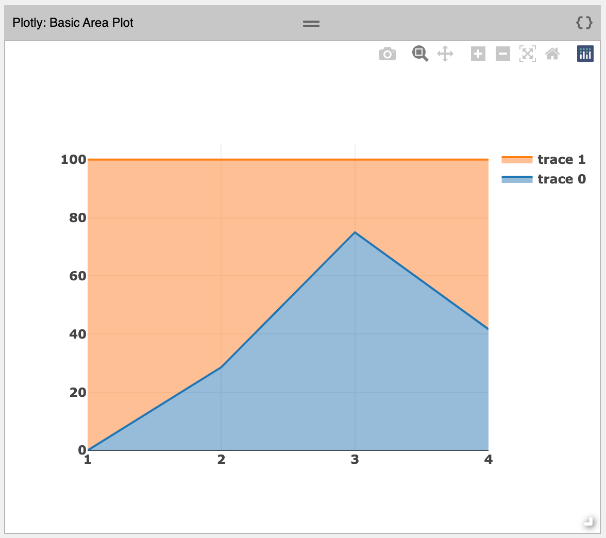|
| [area-plot-02](./area-plot-02.json)| Area Plot.|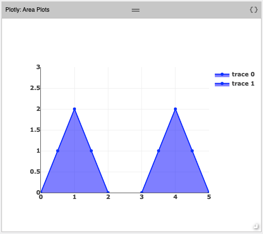|
| [bar-chart-01](./bar-chart-01.json)| Basic Bar Plot.|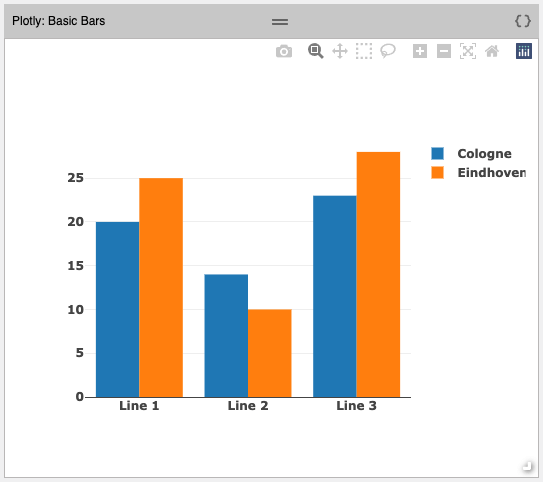|
| [box-plot-01](./box-plot-01.json)| Basic Box Plot.|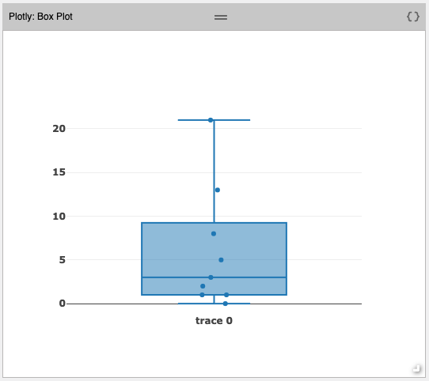|
| [box-plot-02](./box-plot-02.json)| Box Plot with standard deviation.|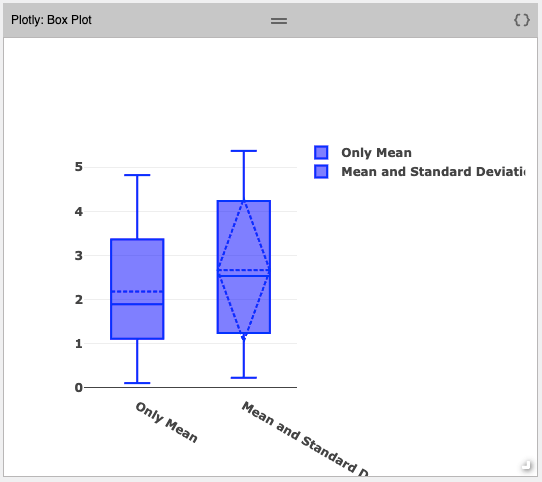|
| [histogram-01](./histogram-01.json)| Histogram.|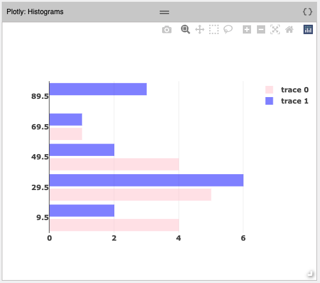|
| [line-chart-01](./line-chart-01.json)| Line Chart.|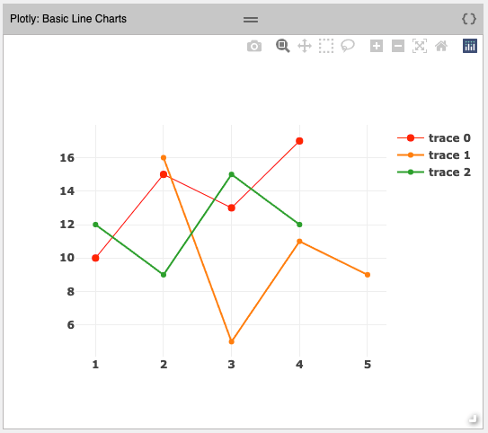|
| [pie-chart-01](./pie-chart-01.json)| Pie Chart with subplots.|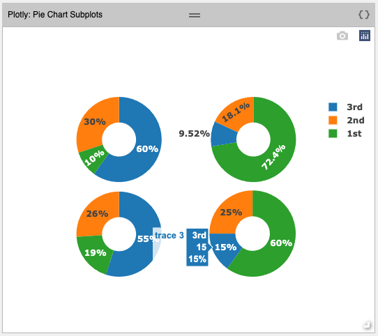|
| [onclick-event-01](./onclick-event-01.json)| Click on a bar in Bar Chart will trigger `onClick` action.|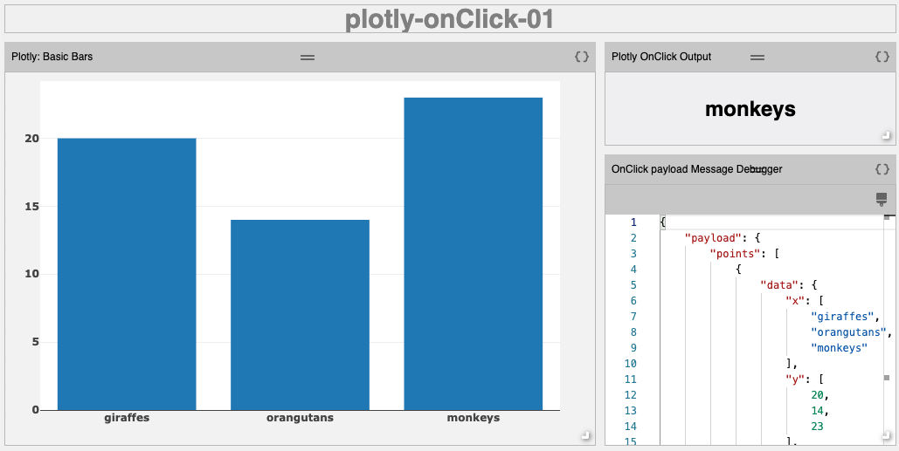|
| [scatter-plot-01](./scatter-plot-01.json)| Basic Scatter Plot.|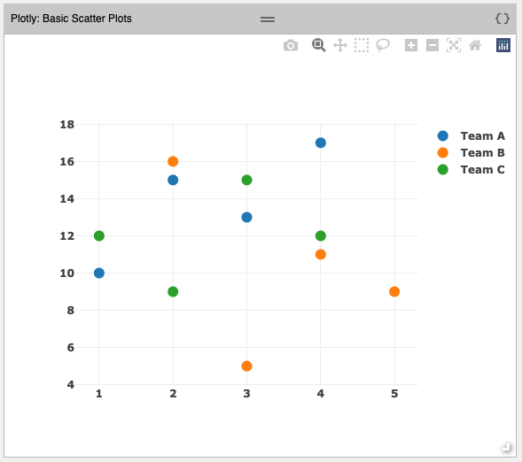|
| [scatter-plot-02](./scatter-plot-02.json)| Scatter Plot with markers and lines.|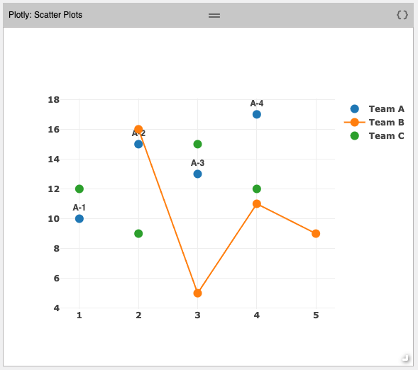|
| [gauge-01](./gauge-01.json)| Basic angular gauge.|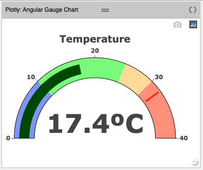|
| [gauge-02](./gauge-02.json)| Data bound gauge. In addition to the value, the gauge delta and thresholds are also updated when a new value is received|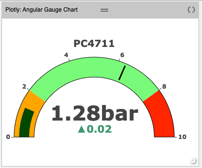|
