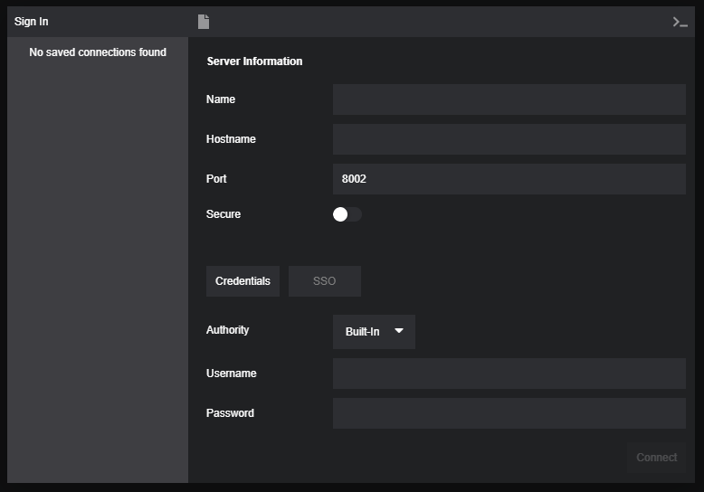
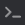
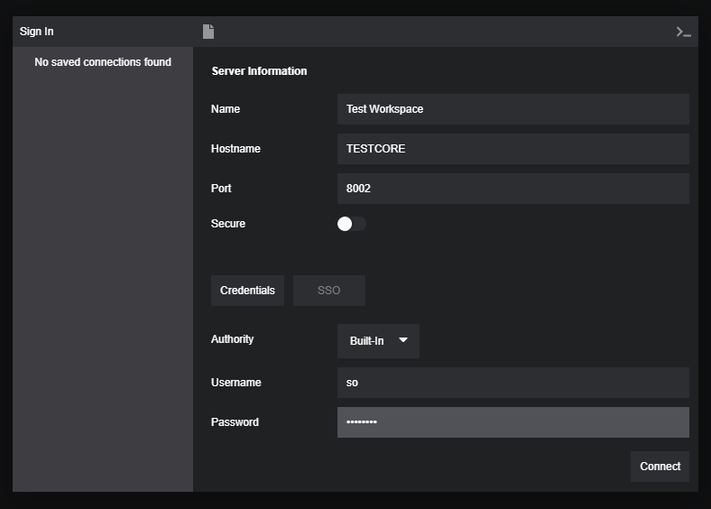
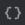
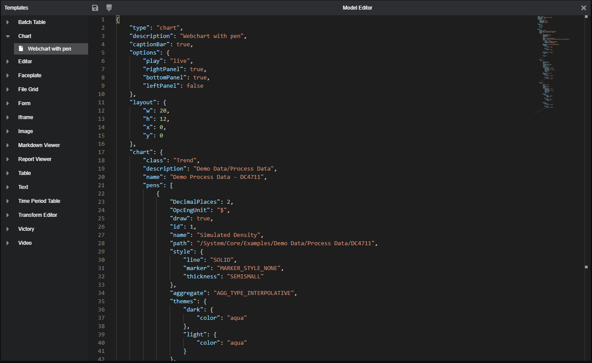
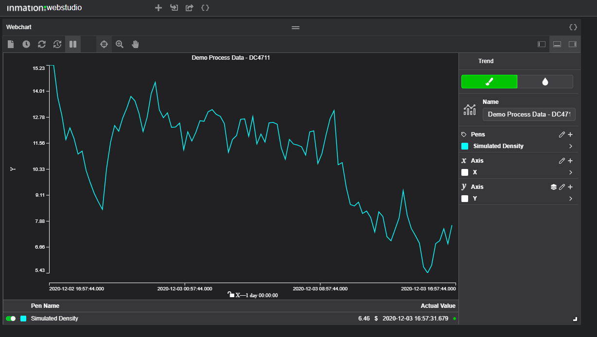

# WebStudio

WebStudio is a Web App that allows you to compile a dashboard of dynamic responsive [widgets](./referencedocs/widgets/README.md) to visualize the data from your inmation system in a web browser. WebStudio uses the [Web API](https://inmation.com/docs/api/latest/webapi/index.html) to retrieve data from the system and allows access to your data from anywhere with an internet connection.

>To begin using WebStudio immediately it is recommended that you create the WebStudio Demo Data objects in your system using the
`Examples_WebStudio_Demo_Data_V<n.nn>.json` MassConfig file available on the [JumpStart Resources page](https://inmation.com/docs/jumpstarts/latest/resources.html). Import the JSON file into a [MassConfig display](https://inmation.com/docs/datastudio/latest/displays-hands-on/working-with-massconfig.html) and click \[Apply\] to create the objects. This will give you a good starting point to begin creating widgets in the workspace.

## Launching WebStudio and Authentication

Like the other [Web Apps](https://inmation.com/docs/webapps/latest/general/index.html), WebStudio connects to the system through the [Web API](https://inmation.com/docs/api/latest/webapi/index.html). To launch the application, open a web browser and enter the url containing the hostname of the Web API you wish to connect to and the port (default is 8002. All connection options can be found [here](./referencedocs/README.md)

```url
    http://<hostname_webapi>:<port>/apps/webstudio/
```
When WebStudio is first opened you will be greeted by a sign-in dialog to authenticate the connection to the Web API and ultimately the core.



-   To connect, you will need to enter the *Hostname* and *Port* and an optional workspace *Name* 
    (any previous connections will be saved and are made available for future use in the *Saved Connections*
    panel on the left).

-   If the Web API has been [configured to communicate over https or a
    secure websocket (WSS)](https://inmation.com/docs/api/latest/webapi/encryption.html), then you can turn on the *Secure* communication switch.

-   The authentication method for connection can be chosen at the bottom
    of the dialog. There is the choice of using given Credentials (the
    built in system Profile Credentials, Active directory, machine
    credentials) or a Single Sign On (SSO) method (Integrate Windows
    Authentication).

| Icon | Function |
|---|---|
|| Click this button to create a new saved connection. Once all the fields are filled in and the \[Connect\] button is pressed, the new entry is persisted and will be available next time the sign-in dialog is used. <br>**Note**: If you already have an existing connections settings selected when the button is pressed, the Hostname, Username and Password fields are cleared, but the name field is retained. Consequently, unless the name is updated, a second item with the same name is created when you connect to the back end. Saved connection details can be managed by clicking the ellipsis (...) next to the saved items |
||Shows the content of the browser console. Reviewing the console logs can be helpful when trying to diagnose connection failures.|

Complete the Sign In Dialog with details appropriate to your own system
and click \[Connect\].



## WebStudio Workspace

Once you have successfully signed in, the WebStudio will open with an empty model screen. 


The icons in the menubar are used to create and edit views. Views/dashboards are generally referred to as [compilations](./referencedocs/readme.md#compilation) in inmation.

| Icon | Function |
|---|---|
||Show the Widgets template dialog used to insert widgets into the compilation|
||Load a previously saved compilation JSON file from disk.|
||Save the current compilation to disk. The file name is based on the compilation "name" field. If the name field is not provided, the filename is set to "Untitled Grid"|
||Display the compilation JSON document in an editor. <BR>**NOTE**: The buttons described so far will be omitted from the UI if the `showDevTools` compilation option is set to false in the JSON or the compilation is loaded from the 
||Toggle between light and dark display themes.|
||Sign out from the inmation core server|

To begin adding widgets to the workspace, click on the "+" icon. This
will open a Model Editor with a series of pre-configured widget template to choose from
(using the [WebStudio Demo Data Items](https://inmation.com/docs/webapps/latest/webstudio/index.html#jumpstarts:resources.adoc)). 



| Icon | Function |
|---|---|
|| Apply model changes made in the editor to the current in memory compilation and close the editor dialog. <br>**Note:** This action does not save changes to persistent storage. If you reload the page for any reason, all in-memory state will be lost! It is therefore advised that while you are developing your compilation you export it at regular intervals, by pressing the  icon at the top of the workspace. |
|  | Format the JSON to align brackets and indent sub-elements. |

The templates can be selected from the left hand pane and this will load
the configuration into the Model Editor. Each widget configuration is
entirely encapsulated in a JSON document as shown in the example above. The
JSON can be edited to change the configuration. In this case the "path" field of the widget `pens` object was set to points directly at objects in the I/O Model of the system.

Add the widget to the compilation by clicking the \[Apply\]



The widget can be moved to any location in the workspace and resized
using the "corner" icon in the bottom right-hand corner of the widget.

To make further configuration changes click on the `{}` icon in the widgets own title-bar. **Note** that the same config can be found in the JSON for the compilation as a whole, contained within its `widgets` array.

The following additional tools are available in the widget editor when loaded from a existing instance:

| Icon | Function |
|---|---|
|  | Compare the current configuration to the "Work model". More about this when we get to "Debugging" |
| | Delete this widget from the compilation|

To learn more about how to create compilations refer top the [getting started](./gettingstarted/README.md) pages.
