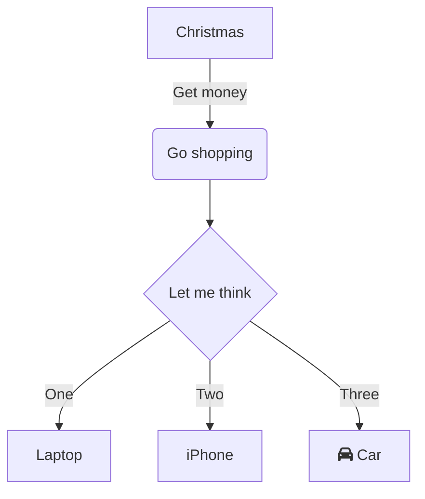
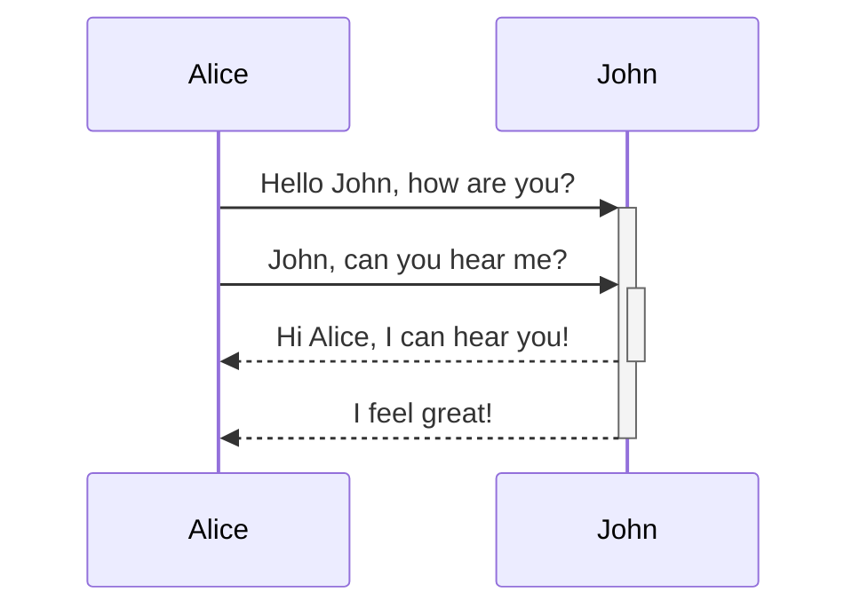
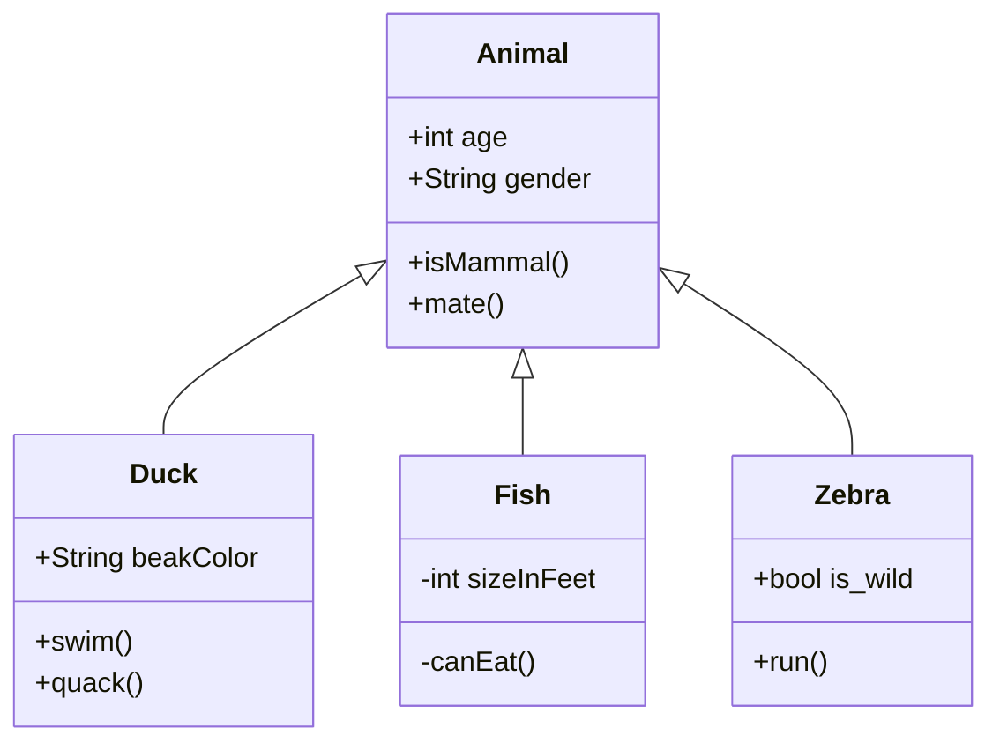
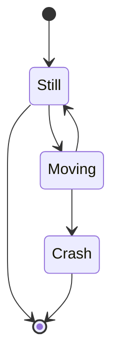
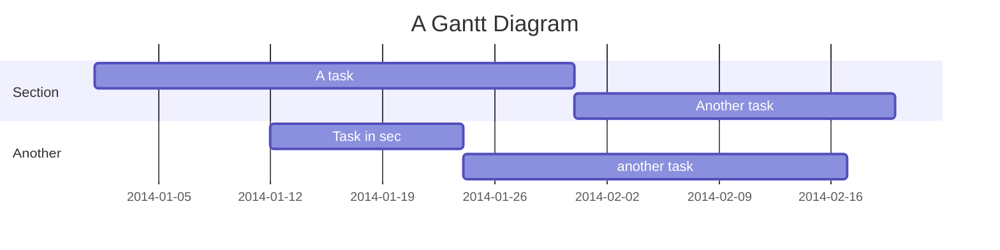
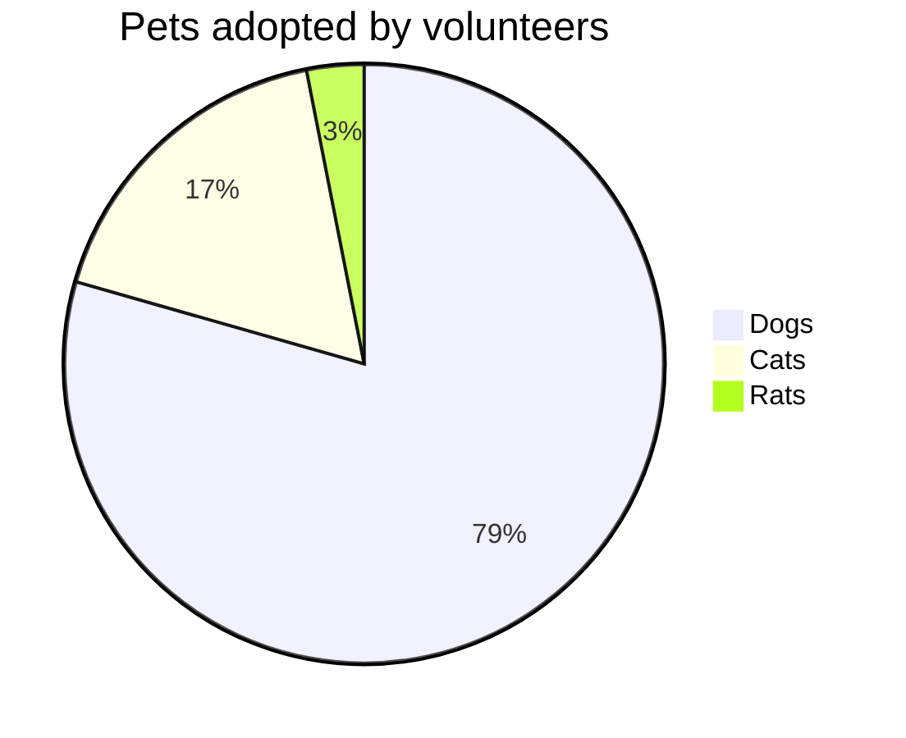
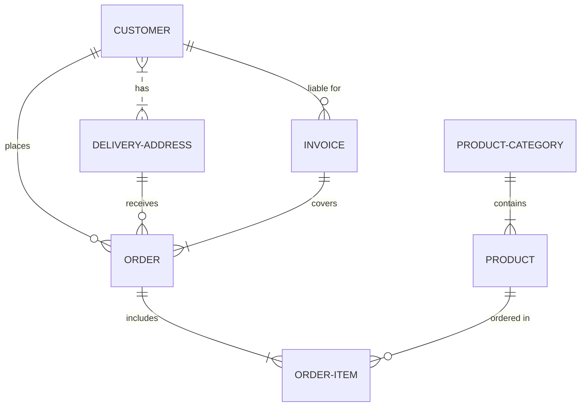

# Mermaid Graph Diagrams

## Displays a simple graph

## Displays another simple graph chart

## Displays a simple Sequence Diagram chart

## Displays a simple Class Diagram

## Displays a simple State Diagram

## Displays a simple Gantt chart

Some more text

## Displays a simple pie chart

## Displays a ER Diagram

